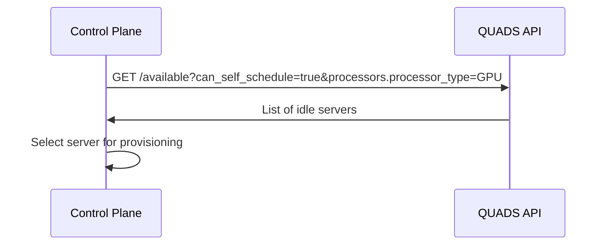
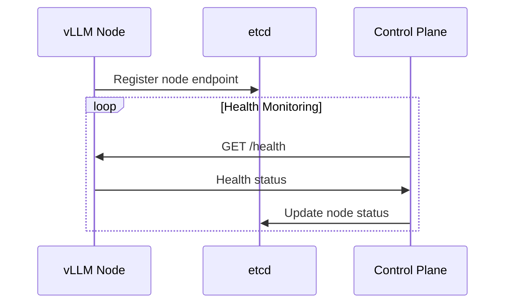
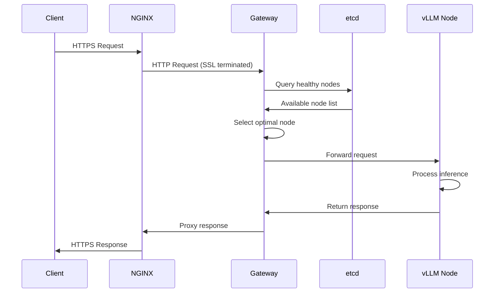

# QUADS LLM Inference Architecture Design Document

## Document Information
- **Version**: 1.1
- **Date**: September 2025
- **Author**: Perf/Scale DevOps Team
- **Status**: Draft

## Table of Contents
1. [Overview](#overview)
2. [Architecture](#architecture)
3. [Component Details](#component-details)
4. [System Workflow](#system-workflow)
5. [Request Flow](#request-flow)
6. [Trade-offs and Design Decisions](#trade-offs-and-design-decisions)
7. [Future Work](#future-work)
8. [Appendix](#appendix)

---

## Overview

### Purpose
This document describes an architecture for utilizing idle servers in the Scale and Alias labs to provide Large Language Model (LLM) inference services using vLLM.

### Scope
The system leverages existing server infrastructure managed by QUADS to dynamically provision LLM inference capabilities when servers are not allocated to users. The architecture prioritizes simplicity and direct resource utilization over complex orchestration.

### Key Objectives
- **Resource Efficiency**: Maximize utilization of idle server capacity
- **Simplicity**: Avoid Kubernetes complexity while maintaining operational reliability
- **Scalability**: Support dynamic addition/removal of inference nodes
- **Performance**: Provide low-latency LLM inference through optimized routing
- **Integration**: Work seamlessly with existing QUADS infrastructure

---

## Architecture

### High-Level Architecture Diagram

```
┌─────────────────┐    ┌─────────────────┐    ┌─────────────────┐
│     Clients     │    │   Monitoring    │    │   NFS Storage   │
│                 │    │    (Future)     │    │   (Models)      │
└─────────┬───────┘    └─────────────────┘    └─────────┬───────┘
          │                                             │
          │ HTTPS Requests                              │ NFS Mount
          ▼                                             │
┌─────────────────┐                                     │
│     NGINX       │                                     │
│  Reverse Proxy  │                                     │
│   (SSL Term.)   │                                     │
└─────────┬───────┘                                     │
          │                                             │
          │ HTTP Requests                               │
          ▼                                             │
┌─────────────────┐    ┌─────────────────┐              │
│    Inference    │◄──►│      etcd       │              │
│     Gateway     │    │ Service Registry│              │
│    (FastAPI)    │    │                 │              │
└─────────┬───────┘    └─────────────────┘              │
          │                     ▲                       │
          │                     │                       │
          │ Load Balanced       │ Registration          │
          │ Requests            │ & Health Checks       │
          ▼                     │                       │
┌─────────────────────────────────────────────────────┐ │
│              vLLM Inference Nodes                   │ │
│  ┌─────────────┐  ┌─────────────┐  ┌─────────────┐  │ │
│  │   Node 1    │  │   Node 2    │  │   Node N    │  │ │
│  │  (Podman)   │  │  (Podman)   │  │  (Podman)   │  │◄┘
│  │    vLLM     │  │    vLLM     │  │    vLLM     │  │
│  └─────────────┘  └─────────────┘  └─────────────┘  │
└─────────────────────────────────────────────────────┘
                          ▲
                          │ SSH Management
                          │
                ┌─────────────────┐    ┌─────────────────┐
                │ Control Plane   │◄──►│   QUADS API     │
                │    (Python)     │    │                 │
                │                 │    │                 │
                └─────────────────┘    └─────────────────┘
```

### Architecture Principles
- **Stateless Design**: Inference nodes are ephemeral and can be created/destroyed without data loss
- **Service Discovery**: etcd provides dynamic service registration and health checking
- **Shared Storage**: NFS ensures all nodes have access to the same model artifacts
- **Centralized Control**: Single control plane manages the entire inference fleet
- **Horizontal Scaling**: Add/remove nodes based on available idle capacity

---

## Component Details

### Control Plane Service

**Technology**: Python application
**Purpose**: Central orchestration and lifecycle management

**Responsibilities**:
- **Server Discovery**: Continuously polls QUADS REST API to identify idle servers
- **Node Provisioning**: Manages the complete lifecycle of inference nodes via SSH
- **Resource Management**: Tracks server allocations and deallocations
- **Health Monitoring**: Monitors node health and handles failures
- **Configuration Management**: Maintains node configurations and deployment parameters

**Key Operations**:
```python
# Pseudocode examples
def discover_idle_servers():
    """Poll QUADS API for available servers"""
    
def provision_inference_node(server_info):
    """Complete node setup: NFS mount → container deploy → etcd registration"""
    
def decommission_node(server_info):
    """Clean shutdown and resource cleanup"""
    
def health_check_nodes():
    """Verify node health and handle failures"""
```

**Configuration**:
- QUADS API endpoints and authentication
- SSH key management for server access
- vLLM container configuration templates
- NFS mount points and model paths
- etcd connection parameters

### vLLM Inference Nodes

**Technology**: Podman containers running vLLM
**Purpose**: Execute LLM inference requests

**Container Specifications**:
```bash
# Example Podman run command
podman run -d \
  --name vllm-inference \
  --gpus all \
  -p 8000:8000 \
  -v /mnt/nfs/models:/models:ro \
  -e MODEL_PATH=/models/llama-2-7b \
  -e MAX_MODEL_LEN=4096 \
  vllm/vllm-openai:latest \
  --model /models/llama-2-7b \
  --served-model-name llama-2-7b \
  --max-model-len 4096
```

**Node Capabilities**:
- **Model Loading**: Load models from shared NFS storage
- **Inference Processing**: Handle OpenAI-compatible API requests
- **Resource Management**: GPU memory and compute optimization
- **Health Endpoints**: Provide health and readiness checks

**Resource Requirements**:
- GPU: Minimum 1x GPU with sufficient VRAM for target models
- Memory: 32GB+ RAM recommended
- Storage: Local SSD for temporary data, NFS for models
- Network: High-bandwidth connection for request handling

### etcd Service Registry

**Technology**: etcd cluster
**Purpose**: Service discovery and configuration management

**Data Schema**:
```json
{
  "nodes/": {
    "node-{server-id}": {
      "endpoint": "http://10.0.1.100:8000",
      "status": "healthy",
      "model": "llama-2-7b",
      "last_heartbeat": "2025-09-12T10:30:00Z",
      "capabilities": {
        "max_tokens": 4096,
        "gpu_memory": "24GB"
      }
    }
  },
  "config/": {
    "gateway": {
      "routing_strategy": "round_robin",
      "health_check_interval": 30
    }
  }
}
```

**Operations**:
- **Node Registration**: Nodes register themselves with connection details
- **Health Tracking**: Maintain node health status through heartbeats
- **Configuration Storage**: Store system-wide configuration parameters
- **Watch Events**: Notify gateway of node additions/removals

### Inference Gateway

**Technology**: FastAPI application
**Purpose**: Request routing and load balancing

**Core Functionality**:
```python
from fastapi import FastAPI
import httpx
import etcd3

app = FastAPI()
etcd_client = etcd3.client()

@app.post("/v1/chat/completions")
async def proxy_request(request: ChatRequest):
    # Get available nodes from etcd
    healthy_nodes = get_healthy_nodes()
    
    # Select node using load balancing strategy
    target_node = select_node(healthy_nodes, request)
    
    # Proxy request to vLLM node
    async with httpx.AsyncClient() as client:
        response = await client.post(
            f"{target_node.endpoint}/v1/chat/completions",
            json=request.dict()
        )
    
    return response.json()
```

**Features**:
- **Load Balancing**: Distribute requests across healthy nodes
- **Health Checking**: Verify node availability before routing
- **Request Validation**: Validate incoming requests before proxying
- **Error Handling**: Graceful handling of node failures with retries
- **Metrics Collection**: Track request patterns and node performance

**Load Balancing Strategies**:
- **Round Robin**: Simple rotation through available nodes
- **Least Connections**: Route to node with fewest active connections
- **Response Time**: Route to fastest responding nodes
- **Model Affinity**: Route requests to nodes with specific models

### NFS Shared Storage

**Technology**: Network File System (NFS v3)
**Purpose**: Centralized model storage and distribution

**Directory Structure**:
```
/nfs/llm-models/
├── llama-2-7b/
│   ├── config.json
│   ├── pytorch_model.bin
│   └── tokenizer.json
├── llama-2-13b/
├── codellama-34b/
└── mistral-7b/
```

**Mount Configuration**:
```bash
# On each inference node
mount -t nfs4 nfs-server:/exports/llm-models /mnt/nfs/models
```

**Performance Considerations**:
- **Read-Only Mounts**: Models are read-only to prevent corruption
- **Caching**: Local node caching for frequently accessed model files
- **Network Optimization**: High-speed network connections to NFS server
- **Redundancy**: RAID configuration and backup strategies

### NGINX Reverse Proxy

**Technology**: NGINX reverse proxy
**Purpose**: External-facing load balancer and SSL termination

**Configuration Example**:
```nginx
upstream inference_gateway {
    server gateway-1:8080;
    server gateway-2:8080;
    server gateway-3:8080;
}

server {
    listen 443 ssl;
    server_name inference-api.company.com;
    
    ssl_certificate /etc/ssl/certs/inference-api.crt;
    ssl_certificate_key /etc/ssl/private/inference-api.key;
    
    location / {
        proxy_pass http://inference_gateway;
        proxy_set_header Host $host;
        proxy_set_header X-Real-IP $remote_addr;
        proxy_buffering off;
    }
}
```

**Features**:
- **SSL Termination**: Handle HTTPS encryption/decryption
- **Gateway Load Balancing**: Distribute traffic across gateway instances
- **Rate Limiting**: Protect against abuse and overload
- **Health Checks**: Monitor gateway availability

---

## System Workflow

### Node Provisioning Lifecycle

#### 1. Server Discovery Phase


#### 2. Node Setup Phase
```python
def provision_node(server_info):
    # Step 1: Verify server accessibility
    ssh_client = establish_ssh_connection(server_info)
    
    # Step 2: Mount NFS storage
    mount_nfs_storage(ssh_client, nfs_config)
    
    # Step 3: Pull container image
    pull_vllm_image(ssh_client)
    
    # Step 4: Start vLLM container
    container_id = start_vllm_container(ssh_client, model_config)
    
    # Step 5: Wait for service readiness
    wait_for_service_ready(server_info.ip, port=8000)
    
    # Step 6: Register in etcd
    register_node_in_etcd(server_info, container_id)
    
    return NodeInfo(server_info, container_id, "active")
```

#### 3. Registration and Health Monitoring


### Node Decommissioning Lifecycle

#### 1. Graceful Shutdown Process
```python
def decommission_node(node_info):
    # Step 1: Mark node as draining in etcd
    mark_node_draining(node_info.server_id)
    
    # Step 2: Wait for active requests to complete
    wait_for_request_completion(node_info, timeout=300)
    
    # Step 3: Remove from etcd
    deregister_node(node_info.server_id)
    
    # Step 4: Stop container
    stop_vllm_container(node_info.ssh_client, node_info.container_id)
    
    # Step 5: Unmount NFS
    unmount_nfs_storage(node_info.ssh_client)
    
    # Step 6: Clean up resources
    cleanup_server_resources(node_info.ssh_client)
```

### Failure Handling

#### Node Failure Recovery
```python
def handle_node_failure(failed_node):
    # Mark node as failed in etcd
    mark_node_failed(failed_node.server_id)
    
    # Attempt graceful recovery
    if can_recover_node(failed_node):
        recover_node(failed_node)
    else:
        # Force cleanup and mark server for investigation
        force_cleanup_node(failed_node)
        mark_server_for_maintenance(failed_node.server_info)
```

---

## Request Flow

### End-to-End Request Processing

#### 1. Client Request Initiation
```bash
curl -X POST https://inference-api.company.com/v1/chat/completions \
  -H "Content-Type: application/json" \
  -H "Authorization: Bearer $API_KEY" \
  -d '{
    "model": "llama-2-7b",
    "messages": [{"role": "user", "content": "Hello!"}],
    "max_tokens": 100
  }'
```

#### 2. Request Flow Sequence


#### 3. Load Balancing Logic
```python
def select_optimal_node(available_nodes, request):
    # Strategy 1: Model affinity
    model_nodes = [n for n in available_nodes if n.model == request.model]
    if not model_nodes:
        raise ModelNotAvailableError(request.model)
    
    # Strategy 2: Load-based selection
    if routing_strategy == "least_connections":
        return min(model_nodes, key=lambda n: n.active_connections)
    elif routing_strategy == "response_time":
        return min(model_nodes, key=lambda n: n.avg_response_time)
    else:  # round_robin
        return next_round_robin_node(model_nodes)
```

### Error Handling and Retries

#### Retry Logic
```python
async def proxy_with_retry(request, max_retries=3):
    for attempt in range(max_retries):
        try:
            node = select_optimal_node(get_healthy_nodes(), request)
            response = await send_request_to_node(node, request)
            return response
        except NodeUnavailableError:
            if attempt == max_retries - 1:
                raise ServiceUnavailableError("No healthy nodes available")
            continue
        except TimeoutError:
            mark_node_slow(node)
            continue
    
    raise ServiceUnavailableError("Max retries exceeded")
```

---

## Trade-offs and Design Decisions

### Advantages

#### Simplicity and Operational Efficiency
- **No Kubernetes Complexity**: Eliminates the operational overhead of managing a Kubernetes cluster
- **Direct Resource Access**: Containers run directly on servers with full hardware access
- **Simplified Networking**: Simple NGINX reverse proxy with Gateway handling all load balancing logic
- **Faster Deployment**: Rapid provisioning through SSH and Podman
- **Centralized Load Balancing**: All routing logic contained in the FastAPI Gateway

#### Cost Effectiveness
- **Resource Utilization**: Maximizes use of existing idle server capacity
- **Infrastructure Reuse**: Leverages existing QUADS infrastructure investment
- **Operational Overhead**: Lower operational complexity compared to container orchestration platforms

#### Performance Benefits
- **Reduced Latency**: Fewer network hops compared to Kubernetes service meshes
- **Direct GPU Access**: No virtualization layer for GPU resources
- **Minimal Overhead**: Podman's lightweight container runtime

### Limitations and Trade-offs

#### Limited Elasticity
- **Manual Scaling Logic**: Control plane must implement all scaling decisions
- **Slower Response to Load**: No built-in auto-scaling capabilities
- **Resource Constraints**: Limited by available idle server capacity

#### Operational Challenges
- **Custom Monitoring**: No built-in observability stack like Kubernetes provides
- **Limited Service Mesh**: Manual implementation of service discovery and routing
- **Deployment Complexity**: Custom deployment and rollback procedures

#### Reliability Concerns
- **Single Points of Failure**: Control plane and etcd require careful HA design
- **State Management**: Manual handling of distributed system challenges
- **Recovery Procedures**: Custom implementation of failure recovery
- **Service Discovery**: Manual implementation of service discovery and routing
- **Deployment Complexity**: Custom deployment and rollback procedures

### Risk Mitigation Strategies

#### High Availability
```python
# Control plane redundancy
def setup_control_plane_ha():
    # Run multiple control plane instances with leader election
    # Use etcd for coordination and state sharing
    # Implement graceful failover mechanisms
```

#### Data Consistency
- **etcd Cluster**: Run etcd in cluster mode for consistency
- **Atomic Operations**: Use etcd transactions for multi-step operations
- **Conflict Resolution**: Handle concurrent modifications gracefully

---

## Future Work

### Phase 1: Advanced Features

#### Intelligent Load Balancing
```python
def ml_based_routing(request, nodes):
    """Use ML models to predict optimal node selection"""
    features = extract_request_features(request)
    node_scores = ml_model.predict_scores(features, nodes)
    return select_highest_scoring_node(nodes, node_scores)
```

#### Model Caching and Optimization
- **Multi-Model Support**: Run multiple models on single nodes
- **Model Caching**: Intelligent caching of frequently used models
- **Dynamic Model Loading**: Load/unload models based on demand
- **Quantization Support**: Support for model optimization techniques

#### Auto-scaling Capabilities
```python
class AutoScaler:
    def evaluate_scaling_decision(self):
        current_load = self.get_current_load()
        available_capacity = self.get_available_servers()
        
        if current_load > self.scale_up_threshold and available_capacity:
            self.provision_new_nodes(calculate_required_nodes(current_load))
        elif current_load < self.scale_down_threshold:
            self.decommission_excess_nodes()
```

### Phase 2: Advanced Infrastructure

#### Geographic Distribution
- **Multi-Region Support**: Deploy across multiple data centers
- **Latency-Based Routing**: Route requests to nearest available nodes
- **Cross-Region Failover**: Implement disaster recovery capabilities

#### Advanced Networking
- **Service Mesh Integration**: Consider Istio or similar for advanced traffic management
- **CDN Integration**: Cache responses for common queries
- **Protocol Optimization**: HTTP/2 and HTTP/3 support for improved performance

#### Security Enhancements
- **mTLS**: Mutual TLS for inter-service communication
- **API Gateway**: Advanced authentication and authorization
- **Network Policies**: Fine-grained network access control
- **Secrets Management**: Secure credential storage and rotation

##### User Authentication (Google OAuth) — Implemented (issue #41)

Gateway user accounts were added as the config-gated, offline-friendly first
authentication tier for the inference API:

- **Sign-in (AUTH-01)**: Users sign in via Google OAuth 2.0 (OpenID Connect,
  email + profile scopes) through `/auth/login` → `/auth/callback`. Accounts are
  keyed by the stable Google `sub` claim; a verified email is required by
  default and an optional hosted-domain allowlist is enforced. Sessions ride a
  signed cookie (`auth.session_secret` + `auth.session_ttl_seconds`), with the
  user id stored rather than re-verified per request.
- **Personal API tokens (AUTH-02)**: The `/profile` page (session-protected)
  mints `qiip_...` bearer tokens for use against
  `/v1/chat/completions` and `/v1/completions`. Tokens are generated with
  `secrets.token_urlsafe(32)`, shown once at creation, and stored only as a
  SHA-256 digest; listing returns just the public `qiip_######` prefix. Tokens
  are revocable individually.
- **Gateway enforcement (AUTH-03)**: Tokens are always validated when
  presented, and enforcement of a bearer requirement for anonymous `/v1`
  requests is config-gated (`auth.enforce_api_tokens`, off by default) so
  existing public deployments are not broken. `/v1/models`, `/health`, and the
  chat playground remain public.
- **Usage tracking (AUTH-04)**: Successful token-authenticated inference
  requests record OpenAI usage (prompt/completion/total tokens) per token,
  model, and endpoint in the SQLite auth store; `/profile/usage` surfaces the
  aggregation.

Persistence is SQLite via the stdlib `sqlite3` module (`auth.db_path`, default
`data/qiip.db`) — intentionally no new services. The admin/operator HTTP Basic
layer is unchanged and separate from user accounts; there is no shared admin
credential exposure on the public profile surface. Remaining security roadmap
items (mTLS, service mesh auth, secrets vault) stay on the roadmap above.

### Phase 3: Platform Evolution

#### Multi-Tenancy Support
```python
class TenantManager:
    def route_request(self, request, tenant_id):
        tenant_config = self.get_tenant_config(tenant_id)
        available_nodes = self.get_tenant_nodes(tenant_id)
        return self.select_node(available_nodes, tenant_config)
```

#### Workflow Orchestration
- **Pipeline Support**: Chain multiple model inferences
- **Batch Processing**: Handle batch inference requests
- **Async Processing**: Support for long-running inference tasks

#### Integration Ecosystem
- **API Gateway Integration**: AWS API Gateway, Kong, or similar
- **Message Queue Support**: RabbitMQ or Apache Kafka for async processing
- **Database Integration**: Results caching and query optimization

---

## Appendix

### A. Configuration Templates

#### Control Plane Configuration
```yaml
# config.yaml
control_plane:
  quads:
    api_url: "https://quads.company.com/api/v1"
    auth_token: "${QUADS_API_TOKEN}"
    poll_interval: 30
  
  ssh:
    private_key_path: "/etc/control-plane/id_rsa"
    connection_timeout: 10
    
  etcd:
    endpoints: 
      - "etcd-1:2379"
      - "etcd-2:2379" 
      - "etcd-3:2379"
    
  nfs:
    server: "nfs.company.com"
    export_path: "/exports/llm-models"
    mount_point: "/mnt/nfs/models"

inference_nodes:
  container_image: "vllm/vllm-openai:v0.2.0"
  default_model: "llama-2-7b"
  max_model_len: 4096
  gpu_memory_utilization: 0.9
```

#### Gateway Configuration
```yaml
# gateway.yaml
gateway:
  host: "0.0.0.0"
  port: 8080
  
  etcd:
    endpoints: 
      - "etcd-1:2379"
      - "etcd-2:2379"
      - "etcd-3:2379"
    
  routing:
    strategy: "least_connections"  # round_robin, response_time, least_connections
    health_check_interval: 30
    max_retries: 3
    timeout: 30
    
  rate_limiting:
    enabled: true
    requests_per_minute: 1000
    burst_size: 100
```

### B. Deployment Scripts

#### Node Provisioning Script
```bash
#!/bin/bash
# provision_node.sh

SERVER_IP=$1
MODEL_NAME=$2
NFS_SERVER=$3

echo "Provisioning inference node on $SERVER_IP"

# Mount NFS storage
ssh root@$SERVER_IP "mkdir -p /mnt/nfs/models"
ssh root@$SERVER_IP "mount -t nfs4 $NFS_SERVER:/exports/llm-models /mnt/nfs/models"

# Pull vLLM image
ssh root@$SERVER_IP "podman pull vllm/vllm-openai:latest"

# Start vLLM container
ssh root@$SERVER_IP "podman run -d --name vllm-inference --gpus all -p 8000:8000 \
  -v /mnt/nfs/models:/models:ro \
  vllm/vllm-openai:latest \
  --model /models/$MODEL_NAME \
  --served-model-name $MODEL_NAME"

echo "Node provisioned successfully"
```

### C. API Documentation

#### Gateway API Endpoints
```yaml
openapi: 3.0.0
info:
  title: LLM Inference Gateway API
  version: 1.0.0

paths:
  /v1/chat/completions:
    post:
      summary: Create chat completion
      requestBody:
        content:
          application/json:
            schema:
              $ref: '#/components/schemas/ChatCompletionRequest'
      responses:
        '200':
          description: Successful response
          content:
            application/json:
              schema:
                $ref: '#/components/schemas/ChatCompletionResponse'

  /health:
    get:
      summary: Health check endpoint
      responses:
        '200':
          description: Service is healthy

```

---

*This document represents the initial design for the LLM inference architecture. It should be reviewed and updated as implementation progresses and requirements evolve.*
